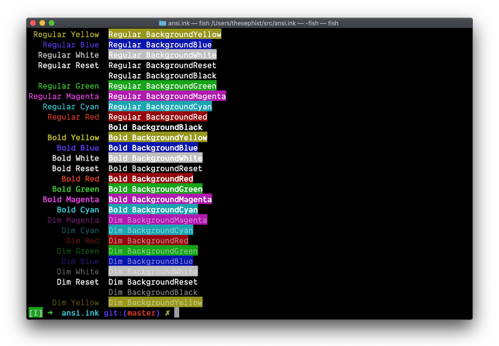

# ansi.ink 🎨

`ansi` is an [Ink](https://github.com/thesephist/ink) library for printing with [ANSI escape sequences](https://en.wikipedia.org/wiki/ANSI_escape_code).



## Usage

`ansi` functions and constants return a `string` value. For cursor movements, simply pass the constant to the `out()` builtin to send the signal to the terminal. For color output, use the styled text string the way you would use any text string; you can concatenate them to other strings and print them out with `out()` or `std.log`.

For example, `out(ansi.ClearLine)` will clear the current terminal output line, and `log((ansi.BoldRed)('bold red text'))` will output a line of bold, red text saying `bold red text`.

### Cursor movement

`ansi` provides the following cursor movement APIs.

- `Backspace` moves the cursor back a single column
- `MoveCursor(x, y)` moves the cursor to column `x` of line `y` on the screen
- `MoveColumn(x)` moves the cursor to column `x` on the current line, and is useful for overwriting parts of lines
- `Home` moves the cursor to position `0, 0` on the screen, and is equivalent to `MoveCursor(0, 0)`
- `Reset` moves the cursor to column `0` of the current line, and is equivalent to `MoveColumn(0)`
- `Clear` clears the current terminal screen, and moves the cursor to `Home`
- `ClearLine` clears the current output line, and moves the cursor to start of line (like `Reset`)
- `ClearLastLine` is like `ClearLine`, but clears the previously printed line, useful for overwriting a line that was printed ending with a newline character

### Text styling

`ansi` provides a `style(weight, color)` higher order function to style text being output to a terminal. You can use `ansi.style` with the weight and color constants in the library to make any text coloring function you need. You can use it like

```
ansi := load('ansi')
style := ansi.style

` create a coloring function `
alert := style(ansi.Weight.Bold, ansi.Color.Red)

` use the function `
log(alert('danger: you are about to do something bad!'))
```

For ergonomics, the library also comes with the following default shorthand coloring functions:

```
Black := style(Weight.Regular, Color.Black)
Red := style(Weight.Regular, Color.Red)
Green := style(Weight.Regular, Color.Green)
Yellow := style(Weight.Regular, Color.Yellow)
Blue := style(Weight.Regular, Color.Blue)
Magenta := style(Weight.Regular, Color.Magenta)
Cyan := style(Weight.Regular, Color.Cyan)
White := style(Weight.Regular, Color.White)
Gray := style(Weight.Regular, Color.Gray)

Bold := style(Weight.Bold, Color.Reset)
BoldBlack := style(Weight.Bold, Color.Black)
BoldRed := style(Weight.Bold, Color.Red)
BoldGreen := style(Weight.Bold, Color.Green)
BoldYellow := style(Weight.Bold, Color.Yellow)
BoldBlue := style(Weight.Bold, Color.Blue)
BoldMagenta := style(Weight.Bold, Color.Magenta)
BoldCyan := style(Weight.Bold, Color.Cyan)
BoldWhite := style(Weight.Bold, Color.White)
BoldGray := style(Weight.Bold, Color.Gray)

Dim := style(Weight.Dim, Color.Reset)
DimBlack := style(Weight.Dim, Color.Black)
DimRed := style(Weight.Dim, Color.Red)
DimGreen := style(Weight.Dim, Color.Green)
DimYellow := style(Weight.Dim, Color.Yellow)
DimBlue := style(Weight.Dim, Color.Blue)
DimMagenta := style(Weight.Dim, Color.Magenta)
DimCyan := style(Weight.Dim, Color.Cyan)
DimWhite := style(Weight.Dim, Color.White)
DimGray := style(Weight.Dim, Color.Gray)
```
